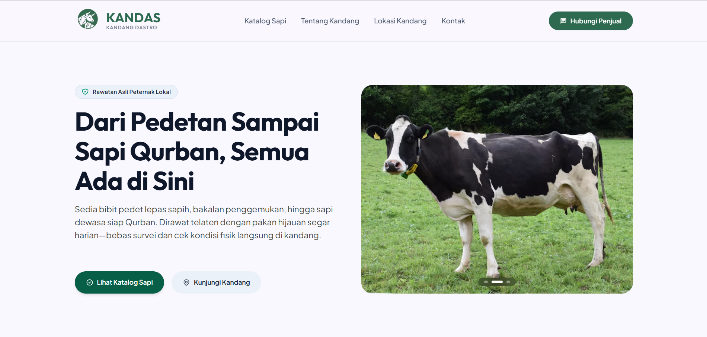

# 🐄 Kandas (Kandang Dastro) — Web Platform Katalog Digital & Sistem Manajemen Peternakan Sapi

[](./backend/README.md)
[](./frontend/README.md)
[](https://vitejs.dev)
[](https://tailwindcss.com)
[](https://www.mysql.com)
[](LICENSE)

**Kandas (Kandang Dastro)** adalah web platform katalog digital dan sistem manajemen peternakan sapi terpadu yang dirancang untuk mendigitalisasi operasional peternakan secara *end-to-end*. Platform ini menyediakan etalase digital interaktif bagi calon pembeli sapi sekaligus modul backoffice komprehensif bagi pengelola kandang untuk mengelola stok ternak, media foto & video, transaksi penjualan, hingga jadwal kunjungan survei fisik.

---

## 🖥️ Tampilan Utama



> **Preview Antarmuka:** Tampilan Landing Page publik dilengkapi *hero banner dynamic carousel*, filter katalog interaktif multi-kategori umur sapi (*Pedetan, Bakalan, Siap Qurban*), status ketersediaan *real-time*, dan tombol pemesanan cepat via WhatsApp.

---

## 👥 Hak Akses & Role Pengguna

Sistem Kandas membagi otorisasi pengguna ke dalam 3 level hak akses:

| Role / Tipe Pengguna | Akses & Wewenang | Fitur Utama yang Dapat Diakses |
|---|---|---|
| 👑 **Admin** | **Akses Penuh (Superuser)** | • Akses ke seluruh modul sistem & laporan finansial<br>• Manajemen master inventaris ternak & multi-media<br>• Manajemen akun profil & user staf<br>• CMS pengaturan profil kandang, rekening, & layout Landing Page |
| 🧑‍🌾 **Staff** | **Akses Operasional Harian** | • Input data sapi baru & upload foto/video<br>• Pembaruan status ketersediaan sapi (*Tersedia, Booked, Terjual*)<br>• Pencatatan transaksi penjualan, DP, & cetak struk invoice digital<br>• Pemantauan notifikasi jadwal survei kunjungan kandang |
| 🌐 **Pengunjung Publik** | **Akses Bebas (Tanpa Login)** | • Melihat etalase katalog sapi lengkap dengan foto resolusi tinggi & video<br>• Melihat spesifikasi detail (bobot hidup, ras, pakan, catatan kesehatan)<br>• Mengajukan form jadwal survei kandang (*visit request*)<br>• Menghubungi kontak WhatsApp kandang & cek lokasi Google Maps |

---

## 📁 Struktur Repositori (Monorepo)

Repositori ini dikelola dengan arsitektur **Monorepo** yang memisahkan antara backend RESTful API dan client web frontend:

```text
kandas-project/
├── backend/                  # REST API Service (Laravel 11 & MySQL / TiDB)
│   ├── app/                  # Controllers, Models, Middleware (AdminAuth)
│   ├── database/             # Migrations & Role/User Seeders
│   ├── routes/               # API Routes (/api/v1)
│   └── README.md             # Dokumentasi teknis lengkap backend
│
├── frontend/                 # Web Client SPA (React 19, Vite, Tailwind CSS)
│   ├── src/                  # Components, Pages, Services, Protected Routes
│   ├── screenshot/           # Preview UI antarmuka
│   └── README.md             # Dokumentasi teknis lengkap frontend
│
└── README.md                 # Dokumentasi utama proyek (Root)
```

### Penjelasan Komponen Monorepo:
* **[`backend/`](./backend):** RESTful API berbasis **Laravel 11** dan **MySQL/TiDB**. Menangani otentikasi token berbasis SHA-256 hash, CRUD inventaris ternak dengan multi-media upload, rekonsiliasi otomatis status transaksi/sapi, dan *database seeder* untuk *role user* dan data awal.
* **[`frontend/`](./frontend):** Single Page Application (SPA) modern berbasis **React 19**, **Vite**, dan **Tailwind CSS**. Mengimplementasikan *Protected Routes* berbasis peran, integrasi Axios dengan auto-token interceptor, modal galeri interaktif, dan cetak invoice digital.

---

## 📚 Tautan Dokumentasi Lengkap

Untuk panduan teknis mendalam mengenai arsitektur, skema database, daftar endpoint API, dan konfigurasi komponen, silakan kunjungi dokumentasi masing-masing sub-proyek:

* 📖 **[Dokumentasi Backend](./backend/README.md)** — Skema database, daftar seluruh endpoint RESTful API, alur rekonsiliasi status transaksi, dan panduan deployment server produksi.
* 📖 **[Dokumentasi Frontend](./frontend/README.md)** — Arsitektur komponen React, panduan environment variable, integrasi Axios interceptors, dan konfigurasi SPA rewrite routing.

---

## 🚀 Cara Menjalankan Project

### Prasyarat Sistem
* **PHP:** Versi 8.2 atau lebih baru + [Composer](https://getcomposer.org/)
* **Node.js:** Versi 18+ atau 20+ + [npm](https://www.npmjs.com/)
* **Database:** MySQL 8.0+ / MariaDB / SQLite / TiDB Cloud

---

### 1. Clone Repository
```bash
git clone https://github.com/donirawans/Website-Peternakan.git kandas-project
cd kandas-project
```

---

### 2. Setup & Menjalankan Backend (Laravel API)

Buka terminal pertama:

```bash
# Masuk ke direktori backend
cd backend

# Pasang dependensi PHP
composer install

# Salin file environment .env
cp .env.example .env
# (Di Windows PowerShell gunakan: copy .env.example .env)

# Generate application key
php artisan key:generate

# Konfigurasi kredensial database di .env, lalu jalankan migrasi & data seeder
php artisan migrate --seed

# Buat symbolic link public storage untuk file foto & video
php artisan storage:link

# Jalankan server backend API
php artisan serve
```
> Server API backend akan aktif di: **`http://127.0.0.1:8000`**

---

### 3. Setup & Menjalankan Frontend (React SPA)

Buka terminal kedua:

```bash
# Masuk ke direktori frontend
cd frontend

# Pasang dependensi Node.js
npm install

# Jalankan development server
npm run dev
```
> Aplikasi web frontend akan aktif di: **`http://localhost:5173`**

---

## 🔐 Kredensial Akun Default (Hasil Database Seeder)

Setelah menjalankan perintah `php artisan migrate --seed`, Anda dapat menggunakan akun bawaan berikut untuk menguji otorisasi sistem:

| Role | Email Login | Password Default | Hak Akses |
|---|---|---|---|
| **Admin** | `admin@kandas.com` | `kandas2026` | Akses penuh ke seluruh menu & modul pengaturan |
| **Staff** | `staff@kandas.com` | `staff2026` | Akses operasional inventaris & transaksi |

---

<div align="center">
  <sub>Dikembangkan untuk modernisasi dan efisiensi operasional <strong>Kandang Dastro (Kandas)</strong>.</sub>
</div>
