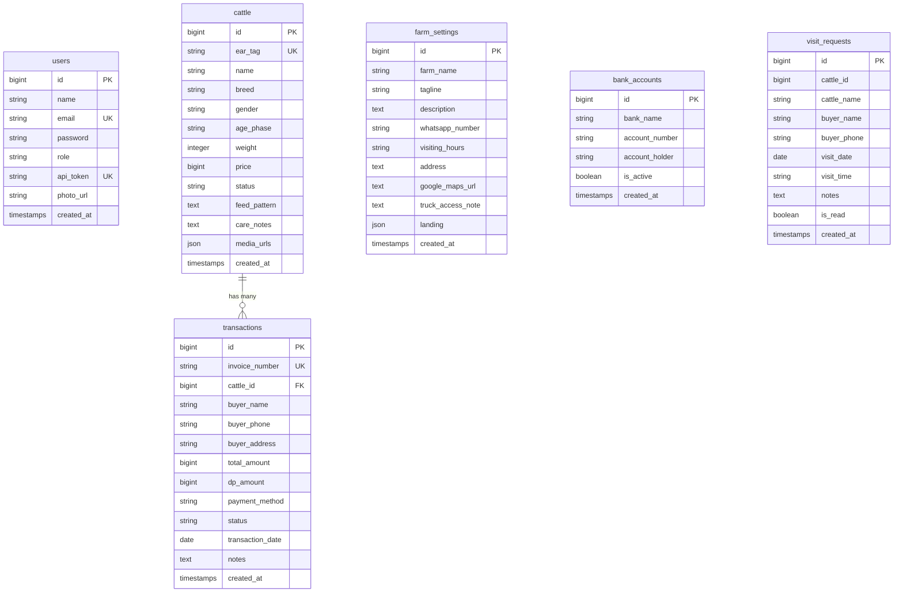

# 🐄 Sistem Kandas (Kandang Dastro) — RESTful API

[](https://laravel.com)
[](https://php.net)
[](https://www.mysql.com)
[](LICENSE)

**Kandas (Kandang Dastro) RESTful API** adalah backend service modern dan scalable yang dibangun menggunakan **Laravel 11**. Layanan ini dirancang khusus untuk digitalisasi manajemen peternakan sapi secara *end-to-end*, mencakup katalog digital publik, reservasi jadwal survei/kunjungan kandang (*visit requests*), manajemen inventaris multi-media (foto & video), transaksi penjualan & DP (*Down Payment*) dengan rekonsiliasi status ternak otomatis, serta profil dan landing page settings.

---

## 📋 Daftar Isi

- [1. Tech Stack & System Requirements](#1-tech-stack--system-requirements)
- [2. Arsitektur & Workflow Sistem](#2-arsitektur--workflow-sistem)
  - [Alur Publik (Landing Page)](#-alur-publik-landing-page)
  - [Alur Inventaris Ternak (Admin / Staff)](#-alur-inventaris-ternak-admin--staff)
  - [Alur Transaksi & Rekonsiliasi Otomatis](#-alur-transaksi--rekonsiliasi-status-otomatis)
- [3. Skema & Struktur Database](#3-skema--struktur-database)
- [4. Dokumentasi Endpoint API](#4-dokumentasi-endpoint-api)
  - [Autentikasi & Profil](#a-autentikasi--profil-admin)
  - [Katalog Publik](#b-katalog-publik)
  - [Manajemen Ternak (Admin)](#c-manajemen-inventaris-ternak-admin)
  - [Pengaturan Peternakan (Farm Settings)](#d-pengaturan-peternakan--landing-page)
  - [Rekening Bank](#e-rekening-bank)
  - [Transaksi & Keuangan](#f-transaksi--laporan-keuangan-admin)
  - [Notifikasi & Permintaan Kunjungan](#g-notifikasi--jadwal-kunjungan-visit-requests)
  - [Media Upload Service](#h-media-upload-service)
- [5. Panduan Instalasi Lokal](#5-panduan-instalasi-lokal)
- [6. Panduan Deployment & Produksi](#6-panduan-deployment--produksi)
- [7. Default Akun & Data Seed](#7-default-akun--data-seed)

---

## 1. Tech Stack & System Requirements

### Core Technologies
* **Framework:** [Laravel 11.x](https://laravel.com)
* **Language Runtime:** PHP 8.2+ / PHP 8.3
* **Database Engine:** MySQL 8.0+ / MariaDB 10.4+ / [TiDB Cloud Serverless](https://tidbcloud.com) (kompatibel penuh MySQL Protocol)
* **Authentication:** Custom Bearer Token Authentication (SHA-256 Hashed `api_token`) via `AdminAuth` middleware
* **Media Storage:** Local Disk Storage (`storage/app/public`) dengan symlink `public/storage`
* **Data Format:** RESTful JSON Specification

### Server & PHP Extensions Requirement
Pastikan extension PHP berikut aktif di server/lingkungan lokal Anda:
* `ext-pdo` & `ext-pdo_mysql`
* `ext-mbstring`
* `ext-openssl`
* `ext-fileinfo` (untuk validasi mime upload gambar & video)
* `ext-bcmath`
* `ext-json`
* `ext-curl`

---

## 2. Arsitektur & Workflow Sistem

```text
┌─────────────────────────────────────────────────────────────────────────────┐
│                             KANDAS SYSTEM ECOSYSTEM                         │
└─────────────────────────────────────────────────────────────────────────────┘

 [ Frontend Landing Page (Publik) ]         [ Frontend Dashboard (Admin / Staff) ]
             │                                                │
             │ (Public Requests)                              │ (Bearer Token: SHA-256)
             ▼                                                ▼
┌─────────────────────────────────────────────────────────────────────────────┐
│                        Laravel 11 API Layer (/api/v1)                       │
├──────────────────────────────────────┬──────────────────────────────────────┤
│  Public Routes (No Auth)             │  Protected Routes (admin.auth MW)    │
│  - GET /public/cattles               │  - Cattle CRUD & Multi-Media Upload  │
│  - GET /public/settings              │  - Transactions & Revenue Analytics  │
│  - GET /public/bank-accounts/active  │  - Visit Request Notifications       │
│  - POST /public/visit-requests       │  - Farm & Landing CMS Settings       │
└──────────────────────────────────────┴──────────────────────────────────────┘
                                       │
                                       ▼
┌─────────────────────────────────────────────────────────────────────────────┐
│                          Database (MySQL / TiDB)                            │
│  [users]  [cattle]  [transactions]  [farm_settings]  [bank_accounts] ...    │
└─────────────────────────────────────────────────────────────────────────────┘
```

### 🌐 Alur Publik (Landing Page)
1. Pengunjung membuka Landing Page tanpa perlu login/autentikasi.
2. Frontend mengambil konfigurasi peternakan (nama kandang, kontak WhatsApp, jam operasional, alamat, embed Google Maps, dan konten kustom landing) melalui `GET /api/v1/public/settings`.
3. Frontend menampilkan katalog sapi aktif melalui `GET /api/v1/public/cattles` (dengan dukungan filter ras, fase umur/kategori, status, rentang harga, dan kata kunci pencarian).
4. Calon pembeli dapat melihat rekening bank resmi melalui `GET /api/v1/public/bank-accounts/active`.
5. Calon pembeli dapat memesan jadwal survei fisik ke kandang melalui form kunjungan `POST /api/v1/public/visit-requests`. Data ini seketika masuk ke panel notifikasi admin.

### 📦 Alur Inventaris Ternak (Admin / Staff)
1. Admin login melalui `POST /api/v1/public/login` dan menerima Bearer Token.
2. Admin mengunggah aset foto dan video ternak secara *bulk* via `POST /api/v1/admin/upload`. Endpoint ini menyimpan file ke public disk dan mengembalikan array URL permanen.
3. Admin membuat/memperbarui data sapi (`POST` / `PUT` `/api/v1/admin/cattles`) dengan menyertakan kode *ear tag*, nama julukan, ras, fase umur, bobot hidup, harga, pola pakan, catatan perawatan, dan array URL media.
4. Ketika data sapi dihapus (`DELETE /api/v1/admin/cattles/{id}`), sistem secara otomatis menghapus file media fisik terkait di storage server guna menghemat kapasitas disk.

### 💳 Alur Transaksi & Rekonsiliasi Status Otomatis
Sistem dilengkapi logika *state reconciliation* otomatis antara tabel `transactions` dan tabel `cattle`:
1. **Pembuatan Transaksi Baru (`POST /api/v1/admin/transactions`):**
   - Sistem men-generate format nomor invoice otomatis `#INV-YYYYMMDD-XXXXXX`.
   - Jika status transaksi = `Lunas`, status sapi otomatis diubah menjadi `Terjual`.
   - Jika status transaksi = `DP Terbayar`, status sapi otomatis diubah menjadi `Booked`.
2. **Pembaruan atau Penghapusan Transaksi (`PUT` / `DELETE` `/api/v1/admin/transactions/{id}`):**
   - Sistem menjalankan rekonsiliasi (`reconcileCattleStatus`).
   - Sistem memeriksa seluruh riwayat transaksi yang tersisa untuk sapi bersangkutan:
     - Jika masih ada transaksi berstatus `Lunas` $\rightarrow$ Status sapi tetap `Terjual`.
     - Jika tidak ada transaksi `Lunas` tetapi ada `DP Terbayar` $\rightarrow$ Status sapi menjadi `Booked`.
     - Jika tidak ada transaksi aktif yang tersisa $\rightarrow$ Status sapi otomatis kembali ke `Tersedia`.

---

## 3. Skema & Struktur Database



### Penjelasan Detail Tabel & Field Utama

| Tabel | Field Utama | Tipe Data | Deskripsi |
|---|---|---|---|
| **`users`** | `name`, `email`, `password`, `role`, `api_token`, `photo_url` | `VARCHAR`, `TEXT` | Akun pengguna backoffice (admin/staff) dengan API token berbasis SHA-256 hash. |
| **`cattle`** | `ear_tag` (Unique), `name`, `breed`, `gender`, `age_phase`, `weight`, `price`, `status`, `feed_pattern`, `care_notes`, `media_urls` | `VARCHAR`, `BIGINT`, `JSON` | Master inventaris ternak. `media_urls` menyimpan array URL foto & video. `status` bernilai `Tersedia`, `Booked`, atau `Terjual`. |
| **`transactions`** | `invoice_number` (Unique), `cattle_id` (FK), `buyer_name`, `buyer_phone`, `buyer_address`, `total_amount`, `dp_amount`, `payment_method`, `status`, `transaction_date`, `notes` | `VARCHAR`, `BIGINT`, `DATE` | Rekod transaksi penjualan sapi. Status: `Lunas`, `DP Terbayar`, `Menunggu Konfirmasi`. Cascade on delete ke sapi terkait. |
| **`farm_settings`** | `farm_name`, `tagline`, `description`, `whatsapp_number`, `visiting_hours`, `address`, `google_maps_url`, `truck_access_note`, `landing` | `VARCHAR`, `TEXT`, `JSON` | Konfigurasi global profil peternakan dan elemen dinamis landing page (*hero, USP, CTA, FAQ*). |
| **`bank_accounts`** | `bank_name`, `account_number`, `account_holder`, `is_active` | `VARCHAR`, `BOOLEAN` | Rekening bank resmi peternakan untuk penerimaan pembayaran / DP. |
| **`visit_requests`** | `cattle_id`, `cattle_name`, `buyer_name`, `buyer_phone`, `visit_date`, `visit_time`, `notes`, `is_read` | `BIGINT`, `VARCHAR`, `BOOLEAN` | Pengajuan jadwal kunjungan fisik & survei kandang dari pengunjung landing page. |

---

## 4. Dokumentasi Endpoint API

Base URL API: `http://localhost:8000/api/v1` (atau URL domain produksi Anda)

> **Catatan Autentikasi:** Semua endpoint berlabel `admin.auth` mewajibkan HTTP Header:
> ```http
> Authorization: Bearer <API_TOKEN_ANDA>
> ```

---

### A. Autentikasi & Profil (Admin)

| Method | Endpoint | Auth | Deskripsi |
|---|---|---|---|
| `POST` | `/public/login` | Publik | Otentikasi admin/staff dan mendapatkan API Token |
| `POST` | `/public/register` | Publik | Registrasi akun admin baru |
| `GET` | `/admin/profile` | Admin | Mengambil data profil user yang sedang login |
| `PUT` | `/admin/profile` | Admin | Memperbarui nama, email, dan foto profil |
| `PUT` | `/admin/profile/password` | Admin | Mengganti password akun |

#### Contoh Request Login:
```json
// POST /api/v1/public/login
{
  "email": "admin@kandas.com",
  "password": "kandas2026"
}
```

#### Contoh Response Login (200 OK):
```json
{
  "status": 200,
  "message": "Login successful",
  "data": {
    "token": "80_CHARACTER_RANDOM_PLAIN_TOKEN",
    "user": {
      "id": 1,
      "name": "Admin Kandas",
      "email": "admin@kandas.com",
      "role": "admin",
      "photo_url": null
    }
  }
}
```

---

### B. Katalog Publik

| Method | Endpoint | Auth | Deskripsi & Parameter Query |
|---|---|---|---|
| `GET` | `/public/cattles` | Publik | Ambil katalog sapi publik. Alias: `/public/katalog`, `/katalog`, `/cattle`. |
| `GET` | `/public/cattles/{id}` | Publik | Ambil detail 1 ekor sapi berdasarkan ID. |

#### Parameter Query untuk `/public/cattles`:
* `status` (opsional): `Tersedia`, `Booked`, `Terjual`, atau `all`
* `category` (opsional): Filter fase umur (misal: `Pedetan`, `Bakalan`, `Siap Qurban`, `Indukan`)
* `breed` (opsional): Filter ras sapi (misal: `Limousin`, `Simental`, `PO`, `Brahman`)
* `gender` (opsional): `Jantan` atau `Betina`
* `min_price` / `max_price` (opsional): Filter batas nominal harga
* `search` (opsional): Pencarian nama sapi, nomor *ear tag*, atau catatan perawatan

#### Contoh Response `/public/cattles` (200 OK):
```json
{
  "status": 200,
  "message": "Cattle retrieved successfully",
  "data": [
    {
      "id": 1,
      "ear_tag": "PD-01",
      "name": "Pedet Limousin Super",
      "breed": "Limousin",
      "gender": "Jantan",
      "age_phase": "Pedetan",
      "weight": 180,
      "price": 16500000,
      "status": "Tersedia",
      "feed_pattern": "Susu Formula + Rumput Gajah",
      "care_notes": "Vaksin lengkap, aktif dan sehat",
      "media_urls": [
        "http://localhost:8000/storage/uploads/pedet_1.jpg",
        "http://localhost:8000/storage/uploads/pedet_video.mp4"
      ],
      "images": [
        "http://localhost:8000/storage/uploads/pedet_1.jpg"
      ],
      "video_url": "http://localhost:8000/storage/uploads/pedet_video.mp4",
      "foto": "http://localhost:8000/storage/uploads/pedet_1.jpg",
      "harga": 16500000,
      "bobot": 180,
      "kelamin": "Jantan",
      "fase": "Pedetan"
    }
  ]
}
```

---

### C. Manajemen Inventaris Ternak (Admin)

| Method | Endpoint | Auth | Deskripsi |
|---|---|---|---|
| `GET` | `/admin/cattles` | Admin | Daftar seluruh sapi admin + statistik total stok, tersedia, booked, dan terjual bulan ini |
| `GET` | `/admin/cattles/{id}` | Admin | Detail spesifik data sapi |
| `POST` | `/admin/cattles` | Admin | Menambahkan data sapi baru |
| `PUT` | `/admin/cattles/{id}` | Admin | Mengubah data sapi |
| `DELETE` | `/admin/cattles/{id}` | Admin | Menghapus sapi dan membersihkan file media di storage |

#### Contoh Request Body `POST /api/v1/admin/cattles`:
```json
{
  "ear_tag": "SIM-099",
  "name": "Simental Monster",
  "breed": "Simental",
  "gender": "Jantan",
  "age_phase": "Siap Qurban",
  "weight": 780,
  "price": 45000000,
  "status": "Tersedia",
  "feed_pattern": "Konsentrat + Ampas Tahu + Rumput Odot",
  "care_notes": "Bebas PMK, sertifikat kesehatan lengkap",
  "media_urls": [
    "http://localhost:8000/storage/uploads/sapi_1.jpg",
    "http://localhost:8000/storage/uploads/sapi_2.jpg"
  ]
}
```

---

### D. Pengaturan Peternakan & Landing Page

| Method | Endpoint | Auth | Deskripsi |
|---|---|---|---|
| `GET` | `/public/settings` | Publik | Mengambil data profil peternakan & konten Landing Page |
| `GET` | `/admin/settings` | Admin | Mengambil data profil untuk form pengaturan admin |
| `PUT` | `/admin/settings` | Admin | Memperbarui profil peternakan dan JSON layout Landing Page |

#### Contoh Request Body `PUT /api/v1/admin/settings`:
```json
{
  "farm_name": "Kandang Dastro Brebes",
  "tagline": "Pusat Sapi Pedetan & Qurban Berkualitas",
  "description": "Sedia bibit unggul dan sapi siap potong dengan perawatan intensif.",
  "whatsapp_number": "6281234567890",
  "visiting_hours": "Setiap Hari (08:00 - 17:00 WIB)",
  "address": "Jalan Pringgadani, Cikeusal Lor, Ketanggungan, Brebes",
  "google_maps_url": "https://maps.app.goo.gl/CCwcvjEQEoJ8MLq87",
  "truck_access_note": "Akses jalan lebar, muat truk fuso & engkel",
  "landing": {
    "hero_title": "Pilihan Terbaik Sapi Berkualitas di Brebes",
    "features": ["Pakan Alami", "Bebas Penyakit", "Siap Antar"]
  }
}
```

---

### E. Rekening Bank

| Method | Endpoint | Auth | Deskripsi |
|---|---|---|---|
| `GET` | `/public/bank-accounts` | Publik | Daftar rekening bank yang berstatus aktif (`is_active = true`) |
| `GET` | `/admin/bank-accounts` | Admin | Daftar semua rekening bank |
| `GET` | `/admin/bank-accounts/{id}` | Admin | Detail rekening bank |
| `POST` | `/admin/bank-accounts` | Admin | Menambahkan rekening bank baru |
| `PUT` | `/admin/bank-accounts/{id}` | Admin | Memperbarui data rekening bank |
| `DELETE` | `/admin/bank-accounts/{id}` | Admin | Menghapus rekening bank |

---

### F. Transaksi & Laporan Keuangan (Admin)

| Method | Endpoint | Auth | Deskripsi |
|---|---|---|---|
| `GET` | `/admin/transactions` | Admin | Daftar transaksi penjualan lengkap + ringkasan kalkulasi omzet |
| `GET` | `/admin/transactions/summary` | Admin | Ringkasan metrik keuangan (total revenue, sold count, pending, avg) |
| `GET` | `/admin/transactions/{id}` | Admin | Detail transaksi berserta relasi objek sapi |
| `POST` | `/admin/transactions` | Admin | Tambah transaksi penjualan & otomatis sinkronisasi status sapi |
| `PUT` | `/admin/transactions/{id}` | Admin | Edit transaksi penjualan & rekonsiliasi status sapi otomatis |
| `DELETE` | `/admin/transactions/{id}` | Admin | Hapus transaksi & rekonsiliasi status sapi otomatis |

#### Format Request `POST /api/v1/admin/transactions`:
```json
{
  "cattle_id": 1,
  "buyer_name": "H. Sulaiman",
  "buyer_phone": "081299887766",
  "buyer_address": "Kec. Jatibarang, Kab. Brebes",
  "total_amount": 25000000,
  "dp_amount": 5000000,
  "payment_method": "Transfer Bank (BCA)",
  "status": "DP Terbayar",
  "transaction_date": "2026-09-01",
  "notes": "Pengiriman H-2 Idul Adha"
}
```
*(Status yang didukung: `Lunas`, `DP Terbayar`, `Menunggu Konfirmasi`)*

---

### G. Notifikasi & Jadwal Kunjungan (Visit Requests)

| Method | Endpoint | Auth | Deskripsi |
|---|---|---|---|
| `POST` | `/public/visit-requests` | Publik | Form pengajuan jadwal kunjungan/survei dari pengunjung |
| `GET` | `/admin/notifications` | Admin | Mengambil daftar pengajuan kunjungan & jumlah yang belum dibaca |
| `PUT` | `/admin/notifications/{id}/read` | Admin | Menandai notifikasi telah dibaca (`is_read: true`) |
| `DELETE` | `/admin/notifications/{id}` | Admin | Menghapus data permohonan kunjungan |

#### Format Request `POST /api/v1/public/visit-requests`:
```json
{
  "cattle_id": 2,
  "cattle_name": "Bakalan Simental Super",
  "buyer_name": "Budi Santoso",
  "buyer_phone": "085712345678",
  "visit_date": "2026-09-10",
  "visit_time": "10:00 WIB",
  "notes": "Ingin cek langsung fisik sapi dan timbang bobot ulang."
}
```

---

### H. Media Upload Service

| Method | Endpoint | Auth | Content-Type | Deskripsi |
|---|---|---|---|---|
| `POST` | `/admin/upload` | Admin | `multipart/form-data` | Upload *multiple* file gambar (`jpg, jpeg, png, gif, webp`) dan video (`mp4, webm`) hingga 50MB per file |

#### Response `POST /api/v1/admin/upload` (201 Created):
```json
{
  "status": 201,
  "message": "Files uploaded successfully",
  "data": {
    "urls": [
      "http://localhost:8000/storage/uploads/1725350000_66d6d8a1.jpg",
      "http://localhost:8000/storage/uploads/1725350001_66d6d8b2.mp4"
    ]
  }
}
```

---

## 5. Panduan Instalasi Lokal

Ikuti langkah-langkah di bawah ini untuk menjalankan server backend di komputer lokal:

### 1. Masuk ke Direktori Backend
```bash
cd backend
```

### 2. Pasang Dependensi PHP (Composer)
```bash
composer install
```

### 3. Konfigurasi Environment File
Salin file template `.env.example` menjadi `.env`:
```bash
# Di Windows PowerShell:
copy .env.example .env

# Di Linux / macOS / Git Bash:
cp .env.example .env
```

### 4. Generate Application Key
```bash
php artisan key:generate
```

### 5. Atur Koneksi Database di File `.env`
Sesuaikan kredensial database Anda (misal menggunakan MySQL lokal):
```env
DB_CONNECTION=mysql
DB_HOST=127.0.0.1
DB_PORT=3306
DB_DATABASE=kandas_db
DB_USERNAME=root
DB_PASSWORD=
```
*(Atau gunakan `DB_CONNECTION=sqlite` untuk pengujian cepat tanpa database server)*

### 6. Jalankan Migrasi & Database Seeder
Eksekusi migrasi tabel dan isi data awal (*users, setting kandang, katalog contoh, rekening*):
```bash
php artisan migrate --seed
```

### 7. Buat Symbolic Link Storage (PENTING untuk Foto/Video)
```bash
php artisan storage:link
```

### 8. Jalankan Local Development Server
```bash
php artisan serve
```
API server akan berjalan di: **`http://127.0.0.1:8000`**

---

## 6. Panduan Deployment & Produksi

Saat mempublikasikan API ke server produksi (VPS, Cloud Server, cPanel, atau PaaS):

### 1. Konfigurasi File `.env` Produksi
```env
APP_NAME="Kandas API"
APP_ENV=production
APP_DEBUG=false
APP_URL=https://api.kandas.com

# Database (Contoh TiDB Cloud Serverless / MySQL Cloud)
DB_CONNECTION=mysql
DB_HOST=gateway01.ap-southeast-1.prod.aws.tidbcloud.com
DB_PORT=4000
DB_DATABASE=kandas_db
DB_USERNAME=xxxx.root
DB_PASSWORD=xxxxxxxx
MYSQL_ATTR_SSL_CA=/etc/ssl/certs/ca-certificates.crt
```

### 2. Konfigurasi CORS (Cross-Origin Resource Sharing)
Pastikan URL domain Frontend Anda sudah didaftarkan di file `config/cors.php`:
```php
'allowed_origins' => [
    'http://localhost:5173',
    'https://kandas.com',
    'https://admin.kandas.com',
    'https://your-frontend.vercel.app'
],
```

### 3. Symlink & File Permissions
Pastikan web server memiliki akses baca-tulis ke folder `storage` dan `bootstrap/cache`:
```bash
php artisan storage:link
chmod -R 775 storage bootstrap/cache
```

### 4. Optimasi Caching Laravel
Jalankan perintah optimasi berikut untuk kecepatan respon maksimal di level produksi:
```bash
composer install --optimize-autoloader --no-dev
php artisan config:cache
php artisan route:cache
php artisan view:cache
```

### 5. Contoh Konfigurasi Nginx Web Server
```nginx
server {
    listen 80;
    server_name api.kandas.com;
    root /var/www/kandas-project/backend/public;

    add_header X-Frame-Options "SAMEORIGIN";
    add_header X-Content-Type-Options "nosniff";

    index index.php;
    charset utf-8;

    # Batas ukuran upload foto & video
    client_max_body_size 64M;

    location / {
        try_files $uri $uri/ /index.php?$query_string;
    }

    location = /favicon.ico { access_log off; log_not_found off; }
    location = /robots.txt  { access_log off; log_not_found off; }

    error_page 404 /index.php;

    location ~ \.php$ {
        fastcgi_pass unix:/var/run/php/php8.2-fpm.sock;
        fastcgi_param SCRIPT_FILENAME $realpath_root$fastcgi_script_name;
        include fastcgi_params;
    }

    location ~ /\.(?!well-known).* {
        deny all;
    }
}
```

---

## 7. Default Akun & Data Seed

Setelah menjalankan `php artisan migrate --seed`, sistem secara otomatis menyediakan akun bawaan untuk kedua role backoffice:

| Peran (Role) | Email | Password | Wewenang & Hak Akses |
|---|---|---|---|
| 👑 **Admin** | `admin@kandas.com` | `kandas2026` | **Akses Penuh (Superuser):** Manajemen master sapi, hapus data, laporan keuangan & omzet, pengaturan profil kandang, rekening bank, CMS Landing Page, dan manajemen akun staf. |
| 🧑‍🌾 **Staff** | `staff@kandas.com` | `staff2026` | **Akses Operasional Harian:** Input data ternak baru, upload foto/video, pembaruan status sapi (*Tersedia/Booked/Terjual*), pencatatan transaksi & cetak struk invoice, dan pemantauan notifikasi survei kandang. |

---

<div align="center">
  <sub>Dikembangkan dengan dedikasi untuk efisiensi dan transparansi operasional <strong>Kandang Dastro (Kandas)</strong>.</sub>
</div>