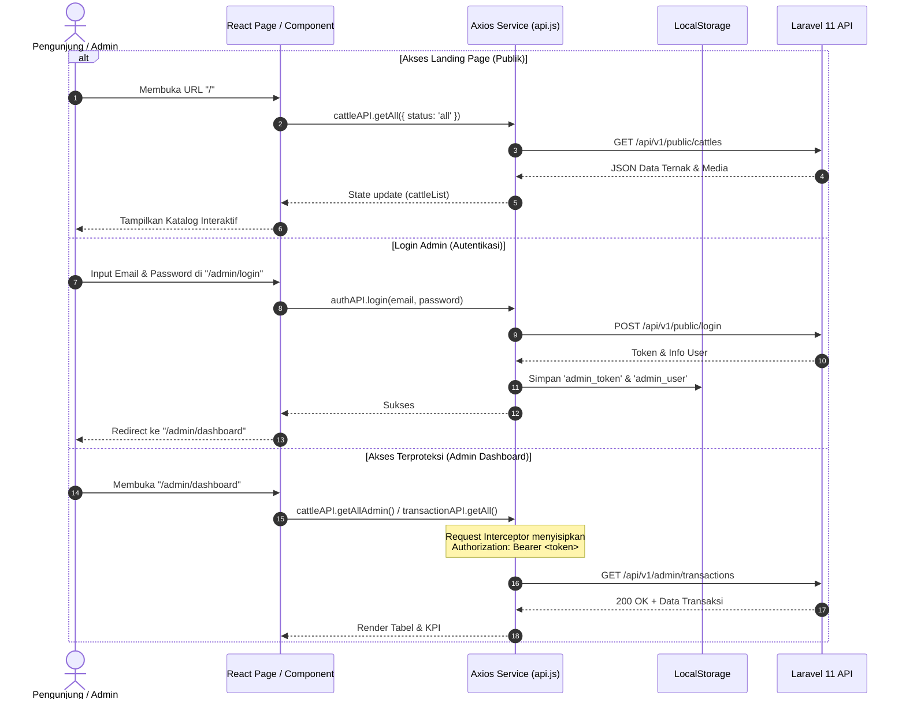

# 🐂 Web Client Kandas (Kandang Dastro) — Katalog Digital & Dashboard Manajemen Peternakan Sapi

[](https://react.dev)
[](https://vitejs.dev)
[](https://tailwindcss.com)
[](https://reactrouter.com)
[](LICENSE)

**Web Client Kandas (Kandang Dastro)** adalah aplikasi web Single Page Application (SPA) modern yang dibangun dengan **React 19**, **Vite**, dan **Tailwind CSS**. Aplikasi ini berfungsi ganda sebagai **katalog digital interaktif publik** bagi calon pembeli sapi serta **dashboard backoffice komprehensif** untuk pemilik kandang dan staf dalam mengelola inventaris ternak, media foto/video, transaksi penjualan, jadwal kunjungan, hingga konten Landing Page.

---

## 🖥️ Tampilan Antarmuka (Preview)


> **💡 Fitur Hero Section & Navigasi Katalog pada Tampilan:**
> * **Hero Section Dinamis:** Menyajikan slider visual sapi resolusi tinggi dengan tajuk utama peternakan, deskripsi layanan terpercaya, ringkasan keunggulan (*Pakan Alami, Bebas PMK, Rawatan Telaten*), serta tombol aksi cepat untuk langsung menjelajahi katalog atau menghubungi via WhatsApp.
> * **Navigasi & Filter Katalog Responsif:** Memudahkan calon pembeli memfilter sapi berdasarkan kategori fase umur (*Semua Stok, Pedetan, Bakalan, Siap Qurban*), status ketersediaan (*Tersedia, Booked, Terjual*), kartu sapi dengan indikator bobot hidup (kg), ras, estimasi harga, dan tombol detail interaktif.

---

## 📋 Daftar Isi

- [1. Tech Stack & Dependensi](#1-tech-stack--dependensi)
- [2. Fitur Utama Sistem](#2-fitur-utama-sistem)
  - [A. Katalog Publik & Interaksi Pembeli](#a-katalog-publik--interaksi-pembeli)
  - [B. Dashboard Manajemen Peternakan (Admin & Staff)](#b-dashboard-manajemen-peternakan-admin--staff)
- [3. Struktur Direktori Proyek](#3-struktur-direktori-proyek)
- [4. Konfigurasi Environment Variable](#4-konfigurasi-environment-variable)
- [5. Panduan Menjalankan Secara Lokal](#5-panduan-menjalankan-secara-lokal)
- [6. Panduan Deployment & Konfigurasi SPA Routing](#6-panduan-deployment--konfigurasi-spa-routing)
- [7. Alur Integrasi API & State Management](#7-alur-integrasi-api--state-management)

---

## 1. Tech Stack & Dependensi

| Kategori | Teknologi | Deskripsi |
|---|---|---|
| **Frontend Framework** | [React 19.x](https://react.dev) | Library UI berbasis komponen dengan performa tinggi & React Hooks modern |
| **Build Tool & Bundler** | [Vite 8.x](https://vitejs.dev) | Next Generation Frontend Tooling dengan Hot Module Replacement (HMR) super cepat |
| **Styling & Design System** | [Tailwind CSS v3.4](https://tailwindcss.com) | Utility-first CSS framework dengan kustomisasi palet warna elegan (*Forest Sage, Emerald, Amber, Slate*) |
| **Routing** | [React Router DOM v7](https://reactrouter.com) | Client-side routing dengan declarative navigation dan Protected Route guard |
| **HTTP Client** | [Axios](https://axios-http.com) | Library pemanggilan API dengan request/response interceptors & auto Bearer Token injection |
| **Image Cropping** | [react-easy-crop](https://github.com/ValentinH/react-easy-crop) | Fitur interaktif pemotongan & penyesuaian rasio foto sapi sebelum proses upload |
| **Icons & Typography** | [Lucide React](https://lucide.dev) & [Google Fonts](https://fonts.google.com) | Ikon modern serta font *Outfit* (headings) dan *Plus Jakarta Sans* (body text) |

---

## 2. Fitur Utama Sistem

### A. Katalog Publik & Interaksi Pembeli
1. **Penyaringan Katalog Multi-Kriteria:**
   - Filter cepat berdasarkan kategori umur (*Pedetan, Bakalan, Siap Qurban*).
   - Filter status sapi (*Tersedia, Booked, Terjual*).
   - Pencarian cerdas berdasarkan nomor *Ear Tag*, nama sapi, ras, atau catatan perawatan.
2. **Modal Detail Sapi Interaktif (`CattleDetailModal`):**
   - **Galeri Multi-Media:** Slider multi-foto resolusi tinggi dan *embedded video player* untuk melihat sapi bergerak secara aktif.
   - **Spesifikasi Lengkap:** Menampilkan ras, estimasi bobot hidup (kg), jenis kelamin, fase umur, pola pakan harian, serta catatan riwayat medis/vaksin.
   - **Tombol WhatsApp Instan:** Menghubungi admin secara otomatis dengan *pre-filled message* yang mencantumkan nama dan ear tag sapi yang diminati.
3. **Form Permintaan Jadwal Kunjungan (Survei Kandang):**
   - Calon pembeli dapat mengisi jadwal survei fisik (nama, no HP, tanggal kunjungan, waktu, dan catatan). Data ini seketika terkirim ke panel notifikasi admin.
4. **Informasi Kandang & Rekening Resmi:**
   - Menampilkan alamat fisik, integrasi peta Google Maps, catatan akses truk (engkel/fuso), jam berkunjung, dan daftar rekening bank resmi peternakan.

---

### B. Dashboard Manajemen Peternakan (Role Admin & Staff)
*(Halaman terproteksi dengan verifikasi token login melalui `ProtectedRoute`)*

Navigasi sidebar dan fitur dashboard beradaptasi secara dinamis sesuai peran (**Role**) pengguna yang login:

| Fitur / Modul | Role Admin | Role Staff | Keterangan |
|---|:---:|:---:|---|
| **Daftar & Master Inventaris Sapi** | ✅ | ✅ | Melihat daftar stok, detail sapi, dan filter ketersediaan |
| **Tambah & Edit Data Sapi** | ✅ | ✅ | Form input sapi, upload multi-media & *image cropper* |
| **Hapus Data Sapi** | ✅ | ❌ | Khusus Admin untuk menjaga integritas data |
| **Laporan Penjualan & Transaksi** | ✅ | ✅ | Input transaksi, cetak struk invoice digital, rekap omzet |
| **Pusat Notifikasi Survei Kandang** | ✅ | ✅ | Memantau jadwal kunjungan survei dari calon pembeli |
| **Pengaturan Profil Diri & Password** | ✅ | ✅ | Mengubah data diri, foto profil, dan password akun |
| **Pengaturan Kandang (Farm Settings)** | ✅ | ❌ | Khusus Admin: Jam operasional, alamat, akses truk |
| **Manajemen Rekening Bank** | ✅ | ❌ | Khusus Admin: Tambah, edit, hapus, & aktifkan rekening |
| **CMS Konten Landing Page** | ✅ | ❌ | Khusus Admin: Kustomisasi banner hero, USP, & teks landing |

1. **Ringkasan Metrik (KPI Cards):**
   - Indikator total stok ternak, unit tersedia, sapi booked (DP terbayar), dan total terjual.
2. **Manajemen Inventaris Ternak (CRUD):**
   - Form penambahan dan edit sapi dengan validasi ear tag unik, ras, bobot, harga, dan pakan.
   - Fitur upload foto/video terpadu dengan pemotong gambar (`ImageCropper`).
   - Fitur hapus sapi yang sekaligus membersihkan file media fisik di server backend.
3. **Laporan Penjualan & Transaksi (`SalesReportPage`):**
   - Pencatatan transaksi penjualan baru (status: *Lunas*, *DP Terbayar*, *Menunggu Konfirmasi*).
   - Sinkronisasi otomatis ke status sapi (*Lunas* $\rightarrow$ Terjual, *DP* $\rightarrow$ Booked).
   - Struk Invoice Digital interaktif (`StrukInvoiceModal`) yang siap dipratinjau dan dicetak langsung.
   - Ringkasan total pendapatan (*revenue*), jumlah transaksi lunas, transaksi pending DP, dan potensi pelunasan.
4. **Pengaturan Peternakan & CMS Landing Page (`FarmSettingsPage` - Khusus Admin):**
   - Kustomisasi nama peternakan, tagline, nomor WhatsApp hotline, jam kunjungan, dan panduan jalan.
   - Pengaturan daftar rekening bank operasional (tambah/edit/hapus/aktifkan rekening).
   - Kustomisasi teks banner, USP keunggulan, dan elemen konten Landing Page secara dinamis tanpa sentuh kode.
5. **Notifikasi Survei Pengunjung:**
   - Notifikasi *real-time* berisi daftar calon pembeli yang mengajukan jadwal survei dengan badge status belum dibaca (*unread*), fitur tandai telah dibaca, dan hapus notifikasi.
6. **Profil Akun & Keamanan (`ProfilePage`):**
   - Update nama lengkap, email, foto profil pengguna (Admin/Staff), dan ganti password akun.

---

## 3. Struktur Direktori Proyek

```text
frontend/
├── public/                     # Aset publik statis (favicon, manifest, robots.txt)
├── screenshot/                 # Screenshot antarmuka aplikasi
│   └── landingpage.png         # Gambar preview landing page
├── src/
│   ├── assets/                 # Aset grafis lokal
│   ├── components/             # Komponen UI Reusable
│   │   ├── AddEditCattleModal.jsx   # Modal form tambah & edit data sapi
│   │   ├── BullLogo.jsx             # Ikon branding logo sapi/banteng Kandas
│   │   ├── CattleCard.jsx           # Kartu katalog sapi dengan harga & foto
│   │   ├── CattleDetailModal.jsx    # Modal popup galeri foto/video & spesifikasi
│   │   ├── Footer.jsx               # Komponen footer landing page
│   │   ├── ImageCropper.jsx         # Modal crop/sesuaikan rasio gambar
│   │   ├── ProtectedRoute.jsx       # Route guard berbasis token auth
│   │   ├── StrukInvoiceModal.jsx    # Modal cetak struk invoice transaksi
│   │   └── TopNavBar.jsx            # Bar navigasi atas publik & admin switch
│   ├── data/                   # Data konstanta & helper harga
│   │   └── cattleData.js
│   ├── pages/                  # Halaman Aplikasi (SPA Views)
│   │   ├── AdminDashboardPage.jsx   # Dashboard utama manajemen inventaris & KPI
│   │   ├── AdminLoginPage.jsx       # Halaman login administrator & staf
│   │   ├── FarmSettingsPage.jsx     # Halaman pengaturan kandang, rekening, & CMS
│   │   ├── HelpCenterPage.jsx       # Halaman panduan operasional sistem
│   │   ├── LandingPage.jsx          # Halaman beranda & katalog publik
│   │   ├── ProfilePage.jsx          # Pengaturan akun profil & ubah password
│   │   └── SalesReportPage.jsx      # Laporan keuangan, transaksi, & rekap omzet
│   ├── services/
│   │   └── api.js              # Instance Axios, interceptors, dan mapping endpoint
│   ├── utils/                  # Utility helpers
│   │   ├── dateFormatter.js    # Format tanggal Indonesia
│   │   ├── imageUrl.js         # Normalisasi URL gambar & fallback placeholder
│   │   └── landingSettings.js  # Konfigurasi default konten landing page
│   ├── App.css                 # CSS global tambahan
│   ├── App.jsx                 # Main component: routing & state load global
│   ├── index.css               # Tailwind directives & CSS font imports
│   └── main.jsx                # React root rendering entry point
├── .env                        # Environment variables lokal
├── eslint.config.js            # Konfigurasi linter ESLint
├── index.html                  # HTML root container SPA
├── package.json                # Dependensi proyek & script npm
├── postcss.config.js           # Konfigurasi PostCSS untuk Tailwind
├── tailwind.config.js          # Konfigurasi tema, font, dan warna Tailwind
└── vite.config.js              # Konfigurasi bundler Vite React
```

---

## 4. Konfigurasi Environment Variable

Frontend berkomunikasi dengan backend Laravel RESTful API menggunakan environment variable `VITE_API_BASE_URL`.

Buat atau sesuaikan file `.env` di root direktori `frontend/`:

```env
# URL endpoint backend API (Gunakan alamat lokal saat development)
VITE_API_BASE_URL=http://127.0.0.1:8000/api/v1
```

> **Catatan Produksi:** Saat di-deploy ke server produksi, ubah nilai variable ini sesuai domain API produksi Anda, contoh:
> ```env
> VITE_API_BASE_URL=https://api.kandas.com/api/v1
> ```

---

## 5. Panduan Menjalankan Secara Lokal

Pastikan Anda telah menginstal **Node.js (versi 18+ atau 20+)** dan **npm** di komputer Anda.

### 1. Masuk ke Direktori Frontend
```bash
cd frontend
```

### 2. Pasang Dependensi Node.js
```bash
npm install
```

### 3. Jalankan Development Server
```bash
npm run dev
```
Server development Vite akan aktif di: **`http://localhost:5173`** (atau port lain yang tersedia).

### 4. Melakukan Build untuk Produksi
```bash
npm run build
```
File bundle JavaScript, CSS, dan HTML siap produksi akan di-generate ke dalam folder `dist/`.

### 5. Melakukan Preview Hasil Build
```bash
npm run preview
```

---

## 6. Panduan Deployment & Konfigurasi SPA Routing

Karena aplikasi ini menggunakan **React Router (`BrowserRouter`)** untuk navigasi halaman (*client-side routing*), web server wajib dikonfigurasi untuk mengalihkan (*rewrite/fallback*) seluruh rute URL ke `index.html`. Tanpa konfigurasi ini, me-refresh halaman seperti `/admin/dashboard` atau `/admin/login` akan memunculkan error **404 Not Found**.

### A. Deployment di Vercel (Disarankan)
Buat file `vercel.json` di root folder `frontend/`:
```json
{
  "rewrites": [
    {
      "source": "/(.*)",
      "destination": "/index.html"
    }
  ]
}
```

### B. Deployment di Netlify
Buat file `_redirects` di dalam folder `frontend/public/_redirects`:
```text
/*    /index.html   200
```

### C. Deployment di Web Server Nginx (VPS / Cloud Server)
Gunakan direktif `try_files` pada konfigurasi blok server Nginx:
```nginx
server {
    listen 80;
    server_name kandas.com www.kandas.com;
    root /var/www/kandas-project/frontend/dist;
    index index.html;

    location / {
        try_files $uri $uri/ /index.html;
    }

    # Caching aset statis (opsional)
    location ~* \.(js|css|png|jpg|jpeg|gif|ico|svg|webp)$ {
        expires 1y;
        add_header Cache-Control "public, no-transform";
    }
}
```

---

## 7. Alur Integrasi API & State Management



---

<div align="center">
  <sub>Dibangun dengan cinta untuk ekosistem digital peternakan modern <strong>Kandang Dastro (Kandas)</strong>.</sub>
</div>
